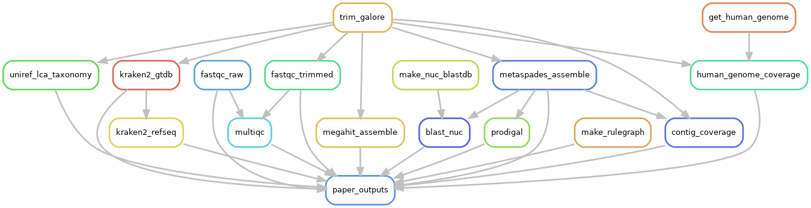

# Concrete metagenome trial

This repository contains processing and analysis of a shotgun metagenome obtained from a concrete sample. The samples was obtained from a deteriorating New Jersey road bridge constructed in 1940. The metagenome of this sample and a blank negative control extraction were sequenced with an Illumina MiSeq by the University of Delaware Sequencing and Genotyping core laboratory.

## Processing

1.  Read quality analysis with fastqc
2.  Adapter & quality trimming with TrimGalore!
3.  Read mapping to human genome to assess contamination 
4.  Taxonomic profiling with Kraken (k-mers) & MMseqs2 (UniRef LCA)
5.  Functional profiling with HUMAnN 3.0
6.  Assembly with metaSPAdes and MEGAHIT
7.  BLAST search for genes involved in ectoine biosynthesis, transport, and degradation

All computational analyses run are defined in the Snakefile which can be reproducibly run using [snakemake](https://snakemake.readthedocs.io/en/stable/).